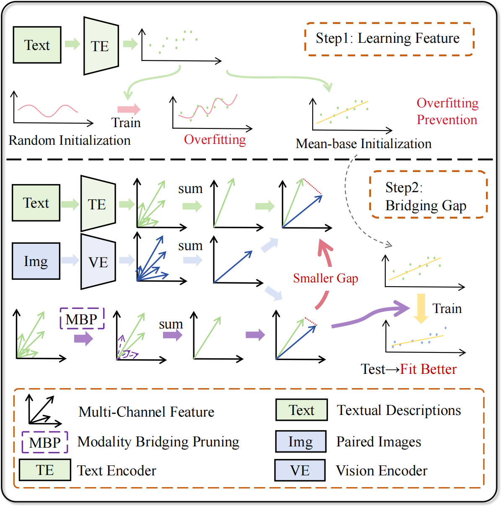

## Category-Specific Channel Pruning for Effective Modality Bridging in Text-only Tuning

## Introduction

This repo officially implements **Category-Specific Channel Pruning for Effective Modality Bridging in Text-only Tuning**.

Modality Bridging Pruning (MBP) selectively activates task-relevant channels, leading to performance improvements across single- and multi-label tasks.

Contact us with pubowei@mail.ustc.edu.cn

Fig.1  Our two-step strategy: Mean-base initialization avoids overfitting, and pruning channels aims to bridge the modality gap, which leads to fit vision embeddings better in TOT. 
.

## Performance Comparison

|                      | DTD | Flowers | IN-R | Aircraft | UCF101 | Food101 | EuroSat | SUN397 | Mean |
|----------------------|-------------------------------|----------------------|-----------------------------|------------------------|------------------|-------------------|------------------|------------------|------------------|
| ZSCLIP               | 40.3                          | 64.0                 | 65.8                        | 18.1                   | 61.0             | 77.1              | 35.9             | 60.8             | 52.8             |
| cls-only             | 37.4                          | 60.4                 | 63.1                        | 15.4                   | 56.4             | 74.3              | 39.1             | 56.3             | 50.3             |
| CLIP (DST)           | 42.4                          | 66.6               | 68.6                      | 19.5                 | 62.4             | 79.3            | 45.8           | 61.7           | 55.8           |
| DST                  | 41.6                          | 64.5                 | 67.5                        | 17.2                   | 62.0             | 77.2              | 43.6             | 61.0             | 54.3             |
| LaFTer | 44.3                        | 64.2                 | 63.6                        | 18.3                   | 63.7           | 78.1              | 44.2             | 60.7             | 54.6             |
| TAP       | 51.1                        | 66.9               | 68.9                      | 21.6                 | 66.3    | 78.5            | 54.2 | 63.4    | 58.9           |
| Our-TF               | 51.7              | 69.7     | 69.8            | 22.3       | 64.6           | 80.5  | 53.3           | 62.2           | 59.3 |
| Our                  | 52.3                 | 72.6        | 70.0               | 22.7          | 65.5 | 80.6     | {55.0    | 63.0} | 60.2    |
